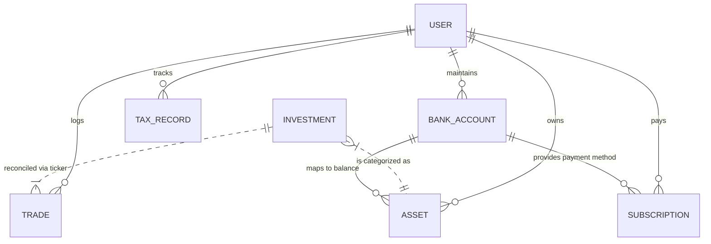
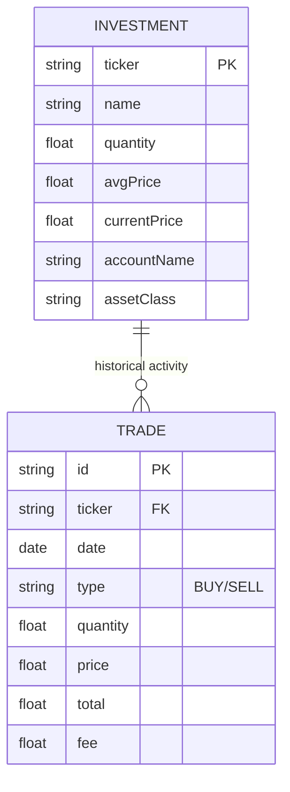
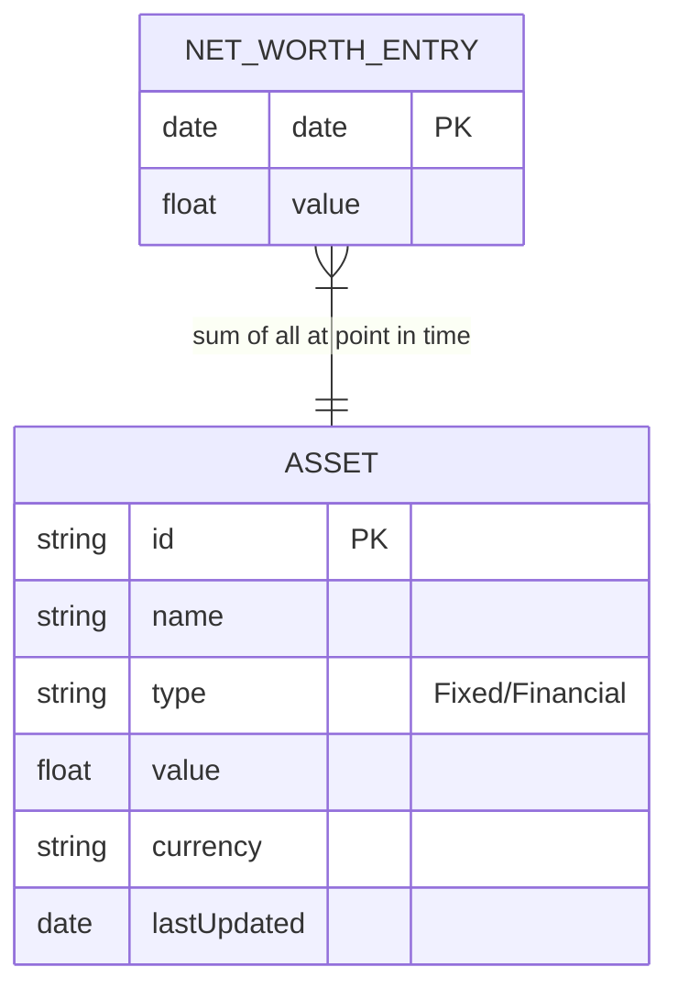
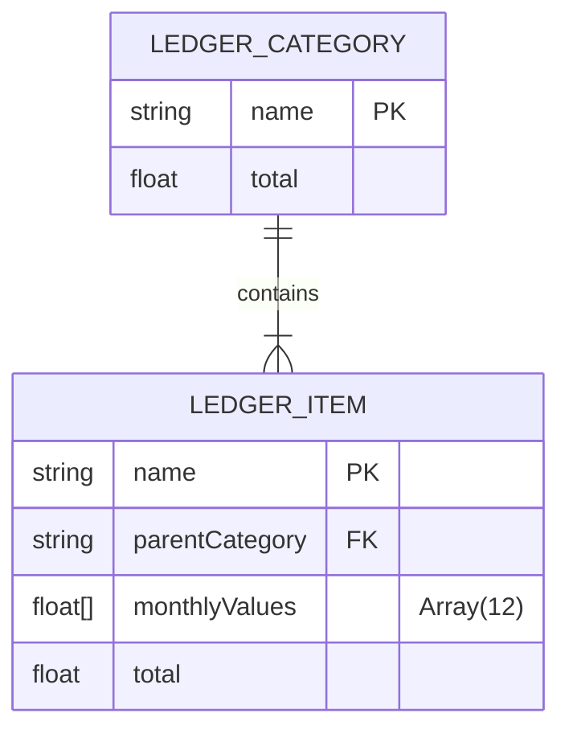
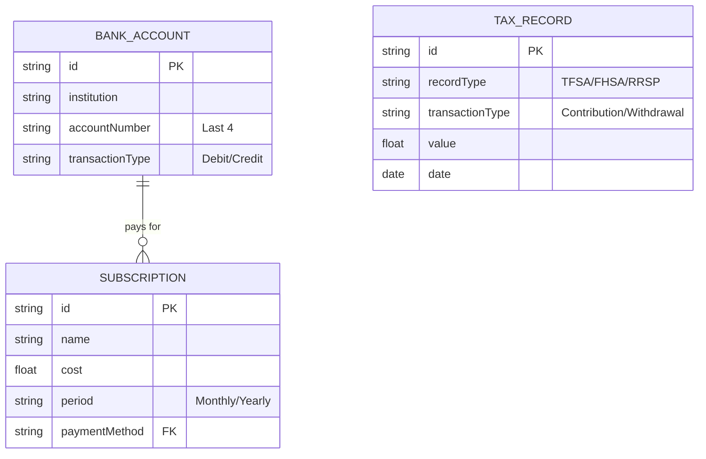

# Sheetsense: Data Model & ER Diagrams

This document outlines the logical relationships between the data entities used within the Sheetsense ecosystem. These relationships are enforced by the application's service layer (e.g., `portfolioService.ts`, `geminiService.ts`).

## 1. Core Component Relationships

The application is divided into five functional modules. While most data is stored in flat tables within Google Sheets, they are reconciled in-memory.

---

## 2. Portfolio Module (Investments & Trades)

The Portfolio module uses a **Reconciliation Engine**. It takes a static snapshot of current assets and applies the historical trade log to determine true net quantities and cost bases.

- **Primary Key**: `ticker` (Normalized to uppercase, e.g., "AAPL").
- **Relationship**: 1 Ticker can have many Trades. The sum of Trade quantities (BUY as +, SELL as -) determines the `Investment.quantity`.

---

## 3. Dashboard & Net Worth Module

This module aggregates all assets and historical snapshots to generate trend lines.

- **Logic**: The `NetWorthEntry` is a time-series record of the total `Asset.value` sum at the moment of a "Log Net Worth" action.

---

## 4. Cash Flow Ledger (Income & Expenses)

The Ledger uses a hierarchical grid model to support the Sankey diagram and monthly budget tracking.

- **Structure**: A `LedgerCategory` (e.g., "Housing") contains multiple `LedgerItems` (e.g., "Rent", "Utilities", "Insurance").
- **Persistence**: Every item maps to a specific `rowIndex` in the Google Sheet for bi-directional updates.

---

## 5. Information & Liabilities Module

This module manages fixed costs, bank account metadata, and tax-advantaged contribution room.

- **Constraint**: `Subscription.paymentMethod` is a string that ideally matches the `BankAccount.institution` or `BankAccount.name` to provide cross-module context.
- **Tax Room**: `TaxRecord` entries are filtered by `recordType` and summed to calculate the "Used" portion of the "Maximum Lifetime Limit" defined for that account type.
